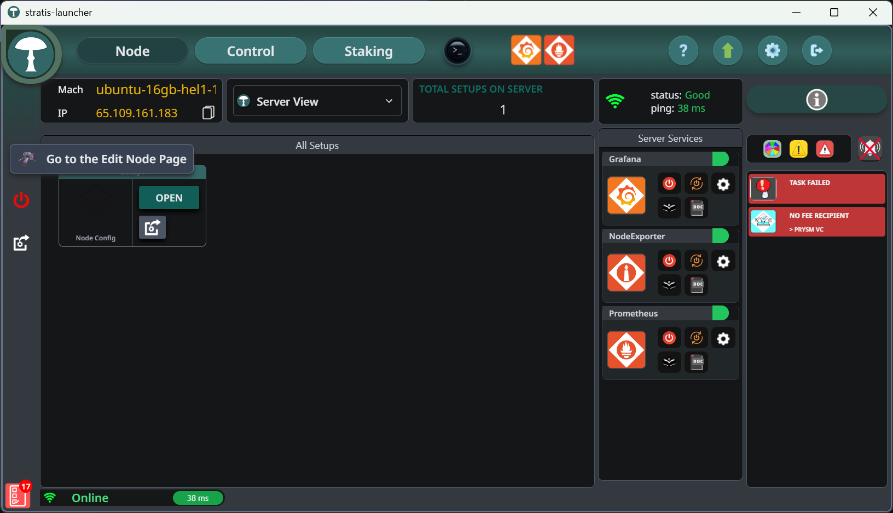
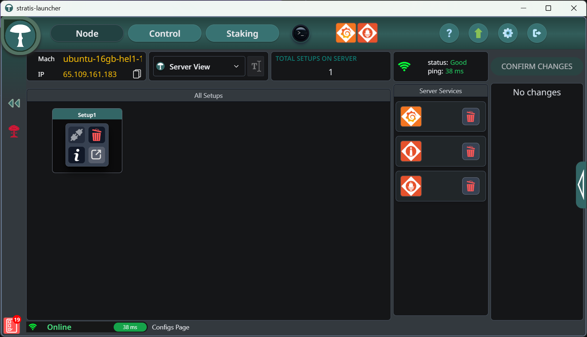
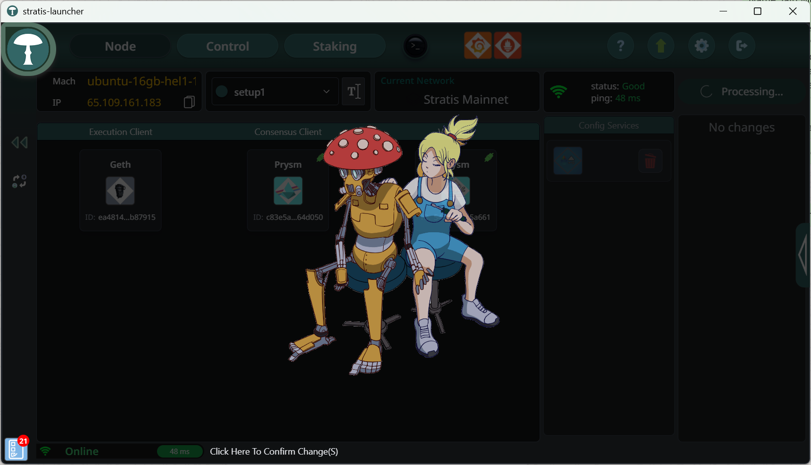
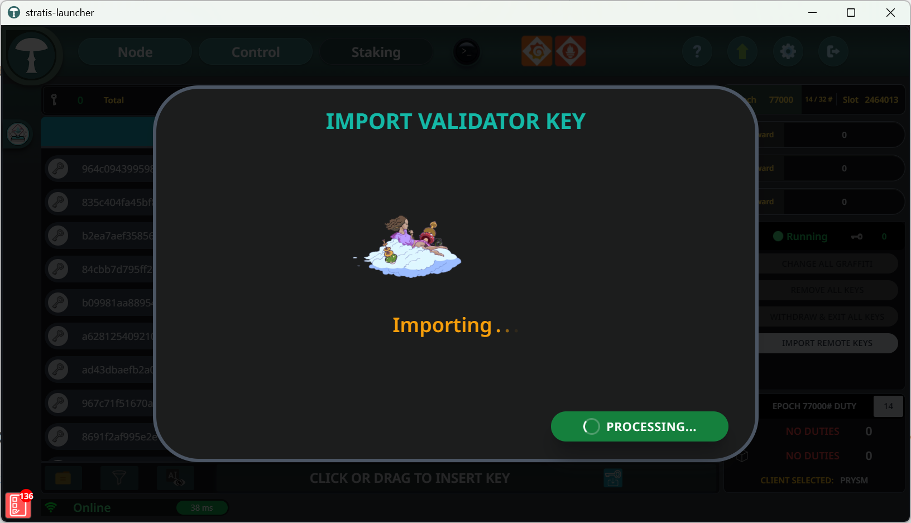

# Masternode Staking Setup Process
This guide will detail how to set up validators eligible for Masternode Staking. Masternode Staking enables you to operate validators and receive a liquid token in return. mSTRAX. The mSTRAX Token can then be deposited in the Masternode dApp for additional return on your token holdings. This guide specifically focuses on the use of the Stratis Launcher. 

If you prefer to set up your Masternode Staking infrastructure manually, you can refer to the manual steps [here](https://github.com/stratisproject/lss-ejector/blob/master/docs/setup.md).

## High-Level Overview

* **Deposit and Minting:** You deposit 1,000,000 STRAX into the protocol and receive mSTRAX, a token that represents your staked position. The mSTRAX Token is accepted as collateral for the Masternode Contract.
* **Validator Ownership:** You are responsible for setting up and managing your own validator. 
* **Ejector Service:** The Ejector Service securely stores your validator keys and manages your validator’s lifecycle. If you choose to exit the protocol (i.e. convert mSTRAX back to STRAX), the Ejector handles the withdrawal of your validator on your behalf.
* **One-to-One Mapping:** Each 1M STRAX deposit is linked to a specific set of validator keys you create. You can only exit the protocol from validators you registered — not from others in the network.
* **Claiming Rewards:** Any rewards earned through the protocol must be manually claimed via the Masternode Staking dApp.

## Requirements

 * 1,000,000 STRAX (additional STRAX is required to fuel gas fees)
 * A Linux-based host which will be configured by the Stratis Launcher
 * A Windows or macOS device that can run the Stratis Launcher

## Important Considerations

 * The Masternode Staking Protocol contract is defined as the Withdrawal Address. (This is checked by the dApp to ensure setup is correct)
 * The 18-day cooling-off period still applies for mSTRAX withdrawals
 * You must wait for Validators to exit and withdraw before you withdraw STRAX

## Validator Set Up using Stratis Launcher

This section will guide you through configuring your Linux-based host to run a full node and an additional ejector service that is used by the protocol to manage your validators.

### Step 1

Download and install the Stratis Launcher: [Stratis Launcher Releases](https://github.com/stratisproject/stratis-node/releases)

### Step 2

Add your Linux host details and Login

### Step 3

Choose 1-Click Install

### Step 4

Choose Stratis Mainnet

### Step 5

Leave the defaults

### Step 6

Leave the defaults

### Step 7

Leave the defaults

### Step 8

The host will now configure itself and begin the synchronisation process

### Step 9

After initial configuration is complete, you can open your configured instance by selecting **OPEN**

### Step 10

We now need to add the Ejector functionality; this is required for Masternode Staking. Click the **Edit Node Page** seen below

### Step 11

You are now on the Edit Node page

### Step 12

Click on the Stratis logo within the Setup1 box to show the listed options. Click the lower right button (square with diagonal arrow) to **Add** an additional service

### Step 13

Click the **Expand** button on the right-hand edge of the screen to reveal the additional configurable services

### Step 14

Select **LssEjector** from this list

### Step 15

Leave the defaults

### Step 16

Select all Clients displayed and press the **Confirm** button

### Step 17

Click the **Confirm changes** button to configure the host

### Step 18

The ejector service has now been configured

## Create new Validator Keys

As part of the Masternode Staking setup, the protocol requires that the contract address is defined as the withdrawal address for your validator keys. This enables the protocol to manage the exiting and withdrawal of STRAX when converting mSTRAX back to STRAX.

### Step 1

Download and install the Wagyu Key Gen for Stratis: [Stratis Wagyu Key Gen Releases](https://github.com/stratisproject/wagyu-key-gen/releases)

### Step 2

Open Wagyu Key Gen and create a new Secret Recovery Phrase

### Step 3

Choose Stratis

### Step 4

Ensure you understand the risks and the importance of keeping your Secret Recovery Phrase secret

### Step 5

A secret recovery phrase has been created, please take note of these words as you will need to confirm them on the following screen

### Step 6

Now you must define the number of keys, password and withdrawal address.

 * Number of New Keys: 50 – This equates to 1,000,000 STRAX
 * Ethereum Withdrawal Address: 0x16CFc478175C222a1eC558baAE290593f175514F – **You must set this address in order for your validators to be accepted by the protocol**
 * 

### Step 7

You now need to define where the keys should be saved to

### Step 8

Your keys are now being created

### Step 9

Your keys have been created

## Importing your Keys via the Stratis Launcher

Now you have created your new keys for validators you want to utilize for the Masternode Staking Protocol, you must now import these keys to your validator client. This is simply achieved via the Stratis Launcher.

### Step 1

Navigate to the Staking Tab and press the **Click or Drag to Insert Key** button. You can now select your newly created keys

### Step 2

Click Prysm as the Validator Client to be used

### Step 3

Enter the password used during the Key Creation in Wagyu Keygen

### Step 4

As these are new validators, we do not need to import a Slashing Protection Database

### Step 5

The keys are now being imported

### Step 6

The keys have been successfully imported

### Step 7

They keys can now be seen on the Node Dashboard

## Deposting STRAX for mSTRAX

Now we have the validators set up, we can deposit 1,000,000 STRAX to the Masternode Staking Protocol. Additionally, the **deposit_data** JSON created when generating your keys is required. This links your registration in the protocol to the keys you’ve just created.

### Step 1

Navigate to [https://staking.masternode.stratisevm.com](https://staking.masternode.stratisevm.com) and select **Deposit Validators**

### Step 2
Upload your **deposit_data** JSON that was created when generating your keys

### Step 3

Perform the deposit of 1,000,000 **STRAX**. In return of this transaction, you will receive 1,000,000 **mSTRAX** Tokens

### Step 4

It can take up to 24 hours for your Validators to become active and begin receiving rewards. Once they are active, rewards can be claimed from the Masternode Staking Protocol dApp on the My Data page seen below

## Register on the Masternode Contract

After the Hardfork on the **11th of June 2025**, the Masternode Contract will allow the deposit of mSTRAX as collateral. The registration process does not differ from the existing. Simply click Register to deposit your mSTRAX as collateral and become a registrant of the contract.

Simply vist https://staking.masternode.stratisevm.com and click **Register** to deposit your collateral.

## Exiting your Validators and Convert mSTRAX to STRAX

Should you wish to withdraw from the protocol, you must first withdraw your mSTRAX from the Masternode Contract.

Once all of your **mSTRAX** is withdrawn from the Masternode Protocol, you can navigate the Masternode Staking Protocol dApp and Exit Staking. This will burn your mSTRAX Tokens and the protocol will manage the exit of your validators.

### Step 1

Navigate to the My Data tab and press Exit Staking

### Step 2

The withdrawal process can take up to 48 hours. Once the associated validators have exited and withdrawn, you can withdraw your STRAX using the “Withdraw” button.

## Need Help?

If you encounter any issues or have questions during setup, please visit our official [Discord Server](https://discord.com/invite/9tDyfZs) for real-time support and community assistance.

---

## Using the Auroria Testnet

You can follow the same steps outlined above to test Masternode Staking on the **Auroria Testnet**. This is highly recommended before proceeding on mainnet to ensure you are familiar with the process.

### Key Differences When Using Auroria:

- **Network Selection:**  
  During host setup in the Stratis Launcher, choose **Stratis Auroria** instead of **Stratis Mainnet**.

- **Withdrawal Recipient Address:**
  
  `0x0504D06711d02E6275e1724529a801441088f9f4`

- **Collateral Token:**  
  Use **tSTRAX** (Testnet STRAX) instead of STRAX. You can obtain test tokens via our [faucet](https://auroria.faucet.stratisevm.com) or Discord.

- **Auroria Masternode Staking URL:**  
  Use the Auroria Masternode Staking dApp at:  
 [https://beta.staking.masternode.stratisevm.com/stake/](https://beta.staking.masternode.stratisevm.com/stake/)

